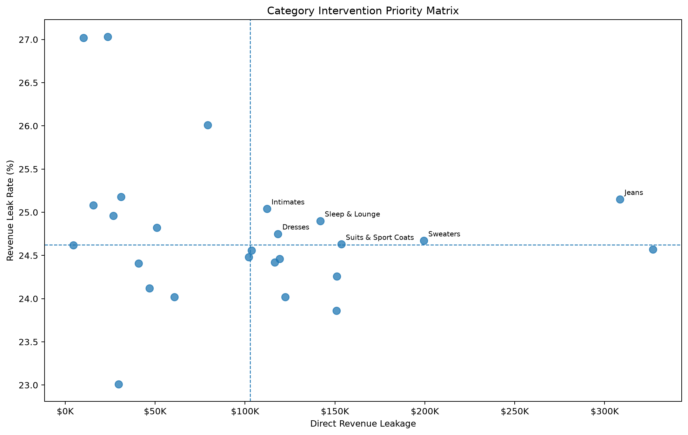
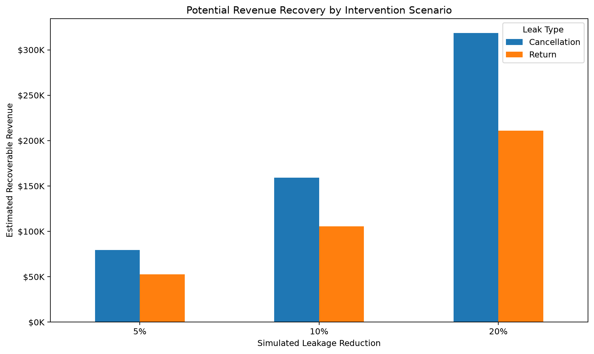
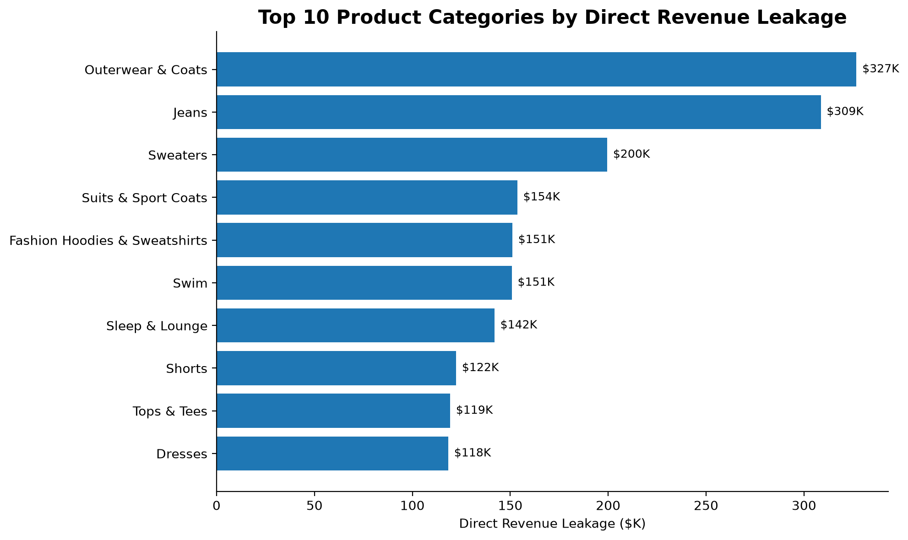
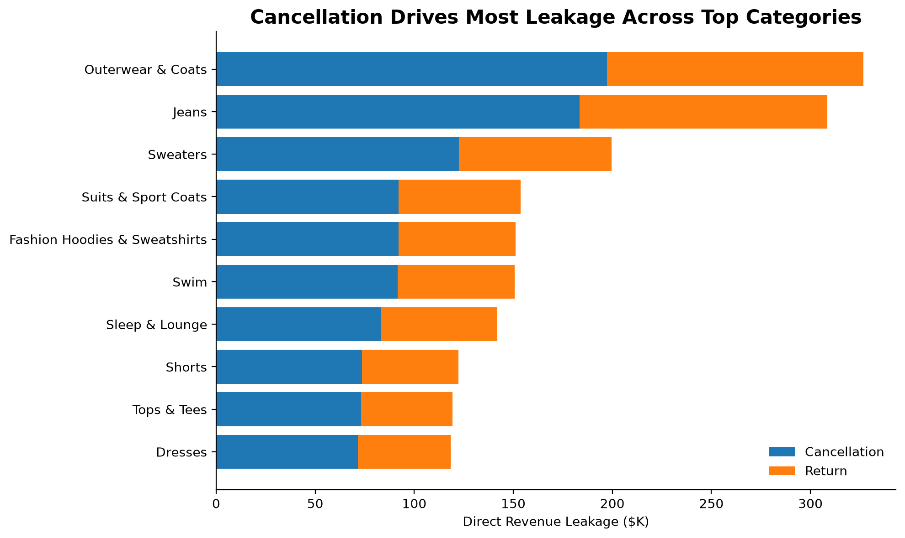
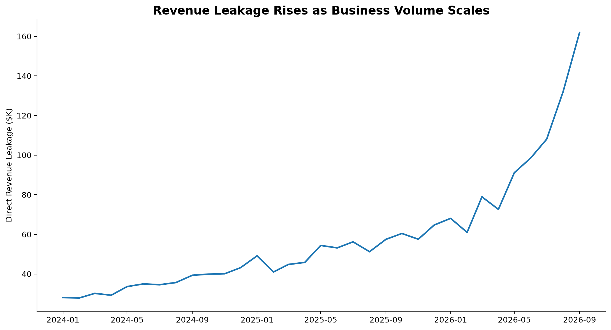
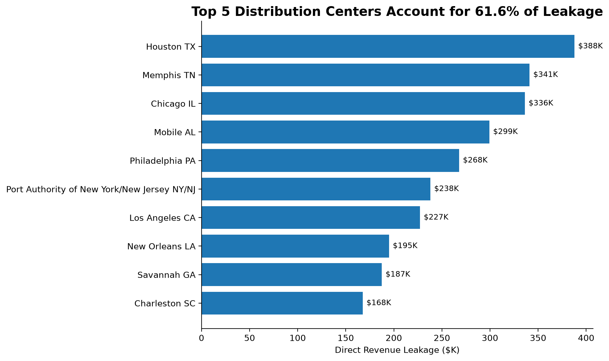

# Revenue Leak Intelligence

> **Where is the business losing money — and where should it intervene first?**

Revenue Leak Intelligence is an end-to-end analytics project that identifies, quantifies, diagnoses, and prioritizes ecommerce revenue leakage using BigQuery, dbt, SQL, and Python.

## Executive Summary

- **$2.67M+** in direct revenue leakage identified
- **4,820 high-risk customers** associated with approximately **$1.26M** in leakage
- **26 product categories** evaluated for intervention
- **6 Tier 1 categories** prioritized for immediate action
- **$1.03M** in Tier 1 leakage opportunity
- Approximately **$103K potential recovery** under a 10% recovery scenario

## Decision Framework

**Detect → Quantify → Diagnose → Prioritize → Simulate Recovery**

The project moves beyond descriptive reporting by translating leakage findings into prioritized intervention opportunities and measurable recovery scenarios.

## Intervention Priority

## Recovery Scenarios

## Revenue Leakage Analysis

### Product Categories

### Leakage Causes

### Monthly Trend

### Distribution Centers

## Tech Stack

**BigQuery | dbt | SQL | Python | Pandas | Git | GitHub**

## Executive Report

[View Executive PowerPoint](reports/revenue_leak_executive_report.pptx)

[View Analytical Story](reports/report_story.md)
